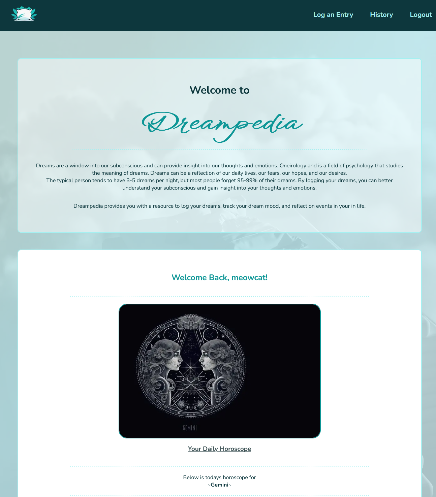

# 🌜~ Dreampedia ~🌛

## _An App to log and track your dreams._# 🌚 🌑

This is a [Next.js](https://nextjs.org/) project bootstrapped with [`create-next-app`](https://github.com/vercel/next.js/tree/canary/packages/create-next-app) and deployed on [Vercel](https://vercel.com/new?utm_medium=default-template&filter=next.js&utm_source=create-next-app&utm_campaign=create-next-app-readme) that allows users to log a description of their dreams, along with how the dream made them feel, and the date of the dream. Dream logs include a dream title which is used to generate a custom dream image with the help of the [`Pexels API`](https://www.pexels.com/) that will be displayed on the history page when retreiving the dream entry.

When user's register to use the application they are asked to select their astrological sign. This is used to generate a daily horoscope on the splash page after logging in. This horoscope is generated by the [`The Horoscope API`](https://horoscope-app-api.vercel.app/).



## Getting Started

First, run the development server:

```bash
npm run dev
# or
yarn dev
```

Open [http://localhost:3000](http://localhost:3000) with your browser to see the result.

## Learn More

To learn more about Next.js, take a look at the following resources:

- [Next.js Documentation](https://nextjs.org/docs) - learn about Next.js features and API.
- [Learn Next.js](https://nextjs.org/learn) - an interactive Next.js tutorial.

You can check out [the Next.js GitHub repository](https://github.com/vercel/next.js/) - your feedback and contributions are welcome!

## Deploy on Vercel

The easiest way to deploy your Next.js app is to use the [Vercel Platform](https://vercel.com/new?utm_medium=default-template&filter=next.js&utm_source=create-next-app&utm_campaign=create-next-app-readme) from the creators of Next.js.

Check out our [Next.js deployment documentation](https://nextjs.org/docs/deployment) for more details.

🌚
